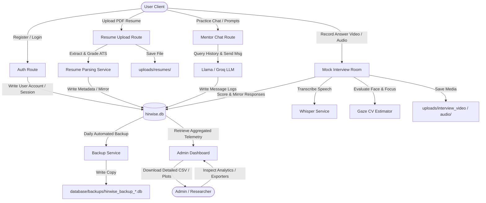

# HireWise AI - Production Database Architecture Guide

This guide details the production-level permanent database architecture, schema layouts, ER diagrams, data flow mechanisms, and directory structures utilized within HireWise AI.

---

## 1. Database & Folder Structure

All persistence structures are initialized relative to the project root. On application startup, the folders and subdirectories are automatically initialized if missing.

```
project_root/
├── database/
│   ├── hirwise.db                 # Primary production SQLite database file
│   └── backups/
│       └── hirwise_backup_*.db    # Automatically scheduled daily backups
└── uploads/
    ├── resumes/                   # Candidate uploaded resume PDFs
    ├── profile_images/            # User avatar uploads
    ├── interview_audio/           # Recorded interview audio answers
    └── interview_video/           # Recorded interview webcam clips
```

*Note: Only the target file paths (relative or resolved paths) are stored in the database. The physical media files and resumes are saved in the dedicated `uploads/` subdirectories.*

---

## 2. Entity-Relationship (ER) Diagram

Below is the database entity schema showing relationships, primary keys, and foreign keys.

```mermaid
erDiagram
    users {
        int id PK
        string username UNIQUE
        string email UNIQUE
        string password_hash
        int role_id FK
        string role
        boolean is_active
        datetime created_at
        string full_name
        string profile_photo
        datetime last_login
    }
    
    roles {
        int id PK
        string name UNIQUE
    }

    resumes {
        int id PK
        int user_id FK
        string file_path
        text extracted_skills
        text projects
        int ats_score
        datetime uploaded_at
    }

    resume_uploads {
        int id PK
        int user_id FK
        string filename
        string file_path
        text parsed_text
        text skills_extracted
        text projects
        text experience
        text certifications
        text missing_skills
        int ats_score
        text suggestions_generated
        text custom_questions
        datetime created_at
    }

    chat_sessions {
        int id PK
        int user_id FK
        string title
        string mode
        int num_messages
        int duration
        datetime created_at
    }

    chat_messages {
        int id PK
        int session_id FK
        int user_id FK
        string sender
        text content
        boolean is_audio
        string audio_path
        datetime created_at
        string message_role
        text message_content
        datetime timestamp
    }

    interview_sessions {
        int id PK
        int user_id FK
        string interview_type
        string company_name
        string status
        datetime created_at
        string question_ids
        int current_index
        boolean asked_follow_up
        int last_question_id
        text last_question_text
        text pending_follow_up
        string role_applied
        int duration
        float overall_score
        text recommendations
        string experiment_mode
        text decision_log
        text competency_map
    }

    interview_responses {
        int id PK
        int interview_id FK
        text question
        text answer
        string skill
        float score
    }

    responses {
        int id PK
        int session_id FK
        int question_id FK
        text question_text
        string audio_path
        string video_path
        text transcript
        int filler_count
        int wpm
        float duration
        float eye_contact_score
        float head_stability_score
        float confidence_score
        float correctness_score
        float answer_score
        text feedback
        datetime created_at
    }

    email_logs {
        int id PK
        int user_id FK
        string email
        string subject
        string event_type
        string status
        datetime sent_at
        string ip_address
    }

    users ||--o| roles : "has role type"
    users ||--o{ resumes : "uploads"
    users ||--o{ resume_uploads : "uploads legacy meta"
    users ||--o{ chat_sessions : "starts"
    chat_sessions ||--o{ chat_messages : "contains"
    users ||--o{ interview_sessions : "undergoes"
    interview_sessions ||--o{ interview_responses : "records"
    interview_sessions ||--o{ responses : "records legacy stats"
    users ||--o{ email_logs : "receives"
```

---

## 3. Data Flow Diagram

The flowchart below traces user interactive data points from input ingestion to database storage and subsequent report exports.



---

## 4. User Data Storage Locations

Every piece of user information matches a persistent storage point:

| User Data Item | Database Model & Table | Field Name | Type | Notes / Description |
| :--- | :--- | :--- | :--- | :--- |
| **User ID** | `User` (`users`) | `id` | `INTEGER` | Primary auto-increment identifier. |
| **Full Name** | `User` (`users`) | `full_name` | `VARCHAR(100)` | User's preferred display name. |
| **Email Address** | `User` (`users`) | `email` | `VARCHAR(120)` | Unique registration email. |
| **Hashed Password** | `User` (`users`) | `password_hash` / `hashed_password` | `VARCHAR(128)` | Secure hashed credentials (pbkdf2:sha256). |
| **Profile Photo Path** | `User` (`users`) | `profile_photo` | `VARCHAR(256)` | Path referencing file in `uploads/profile_images/`. |
| **Registration Date** | `User` (`users`) | `created_at` / `registration_date` | `DATETIME` | Account initialization timestamp. |
| **Last Login Time** | `User` (`users`) | `last_login` | `DATETIME` | Recorded on login sessions. |
| **User Role** | `User` (`users`) | `role` | `VARCHAR(50)` | Role indicator string (`'user'` or `'admin'`). |
| **Account Status** | `User` (`users`) | `is_active` / `account_status` | `BOOLEAN` | True if account is enabled. |
| **Chat Session ID** | `ChatSession` (`chat_sessions`) | `id` | `INTEGER` | Primary key of chat thread. |
| **Chat Creator ID** | `ChatSession` (`chat_sessions`) | `user_id` | `INTEGER` | Foreign key mapping to `users.id`. |
| **Chat Created At** | `ChatSession` (`chat_sessions`) | `created_at` | `DATETIME` | Thread initialization timestamp. |
| **Chat Message ID** | `ChatMessage` (`chat_messages`) | `id` | `INTEGER` | Message identifier. |
| **Message Session ID** | `ChatMessage` (`chat_messages`) | `session_id` | `INTEGER` | Foreign key referencing `chat_sessions.id`. |
| **Message Role** | `ChatMessage` (`chat_messages`) | `message_role` / `role` | `VARCHAR(50)` | Ingested as `'user'` or `'assistant'`. |
| **Message Content** | `ChatMessage` (`chat_messages`) | `message_content` / `message` | `TEXT` | Message text content. |
| **Message Timestamp** | `ChatMessage` (`chat_messages`) | `timestamp` / `created_at` | `DATETIME` | Message send timestamp. |
| **Interview Session ID**| `InterviewSession` (`interview_sessions`)| `id` | `INTEGER` | Primary key of interview session. |
| **Interview User ID** | `InterviewSession` (`interview_sessions`)| `user_id` | `INTEGER` | Foreign key mapping to `users.id`. |
| **Interview Target Co.** | `InterviewSession` (`interview_sessions`)| `company_name` / `company` | `VARCHAR(50)` | Designated target firm (Company Mode). |
| **Interview Applied Role**| `InterviewSession` (`interview_sessions`)| `role_applied` / `role` | `VARCHAR(100)` | Focus domain target. |
| **Interview Date** | `InterviewSession` (`interview_sessions`)| `created_at` / `date` | `DATETIME` | Session start timestamp. |
| **Interview Duration** | `InterviewSession` (`interview_sessions`)| `duration` | `INTEGER` | Aggregate length in seconds. |
| **Interview Score** | `InterviewSession` (`interview_sessions`)| `overall_score` | `FLOAT` | Out of 100 points. |
| **Recommendations** | `InterviewSession` (`interview_sessions`)| `recommendations` | `TEXT` | LLM-generated improvement guidelines. |
| **Response ID** | `InterviewResponse` (`interview_responses`)| `id` | `INTEGER` | Answer response key. |
| **Response Interview ID**| `InterviewResponse` (`interview_responses`)| `interview_id` | `INTEGER` | Foreign key mapping to `interview_sessions.id`.|
| **Interview Question** | `InterviewResponse` (`interview_responses`)| `question` | `TEXT` | Prompt text presented. |
| **Interview Answer** | `InterviewResponse` (`interview_responses`)| `answer` | `TEXT` | Candidate transcription response text. |
| **Interview Skill** | `InterviewResponse` (`interview_responses`)| `skill` | `VARCHAR(100)` | Assessed topic target (Adaptive Mode). |
| **Response Score** | `InterviewResponse` (`interview_responses`)| `score` | `FLOAT` | Grading score (0-100). |
| **Resume Upload ID** | `Resume` (`resumes`) | `id` | `INTEGER` | Resume record identifier. |
| **Resume User ID** | `Resume` (`resumes`) | `user_id` | `INTEGER` | Foreign key mapping to `users.id`. |
| **Resume File Path** | `Resume` (`resumes`) | `file_path` | `VARCHAR(512)` | Disk path in `uploads/resumes/`. |
| **Extracted Skills** | `Resume` (`resumes`) | `extracted_skills` | `TEXT` | Extracted resume tags. |
| **Projects List** | `Resume` (`resumes`) | `projects` | `TEXT` | Synthesized descriptions of projects. |
| **Resume ATS Score** | `Resume` (`resumes`) | `ats_score` | `INTEGER` | Score benchmark (0-100). |
| **Upload Timestamp** | `Resume` (`resumes`) | `uploaded_at` / `created_at` | `DATETIME` | Time uploaded. |
| **Email Log ID** | `EmailLog` (`email_logs`) | `id` | `INTEGER` | Email identifier. |
| **Email Recipient ID** | `EmailLog` (`email_logs`) | `user_id` | `INTEGER` | Foreign key referencing `users.id`. |
| **Email Subject** | `EmailLog` (`email_logs`) | `subject` | `VARCHAR(256)` | Subject line header. |
| **Email Status** | `EmailLog` (`email_logs`) | `status` | `VARCHAR(100)` | E.g. `'Sent'`, `'Failed'`. |
| **Email Sent At** | `EmailLog` (`email_logs`) | `sent_at` | `DATETIME` | Dispatch timestamp. |
